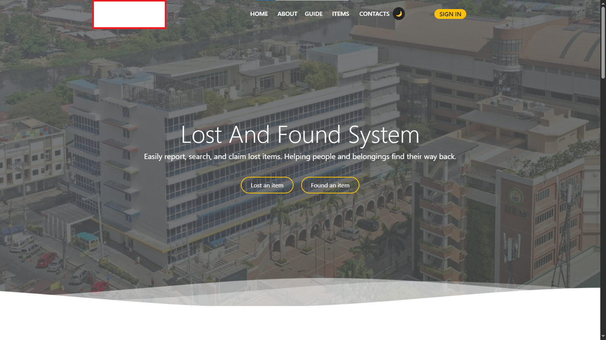
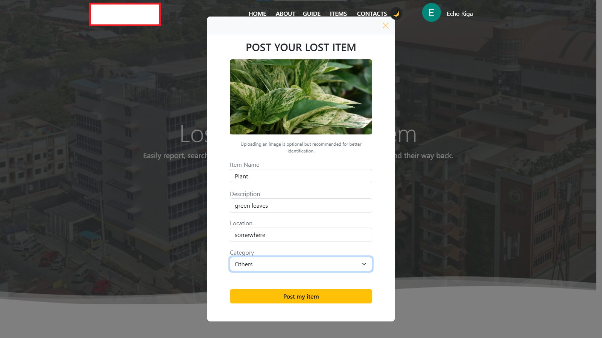
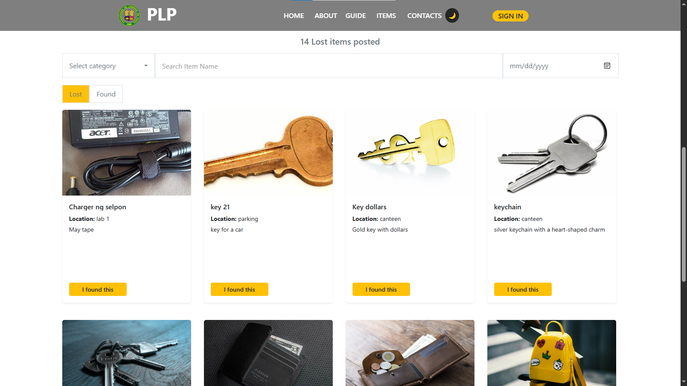
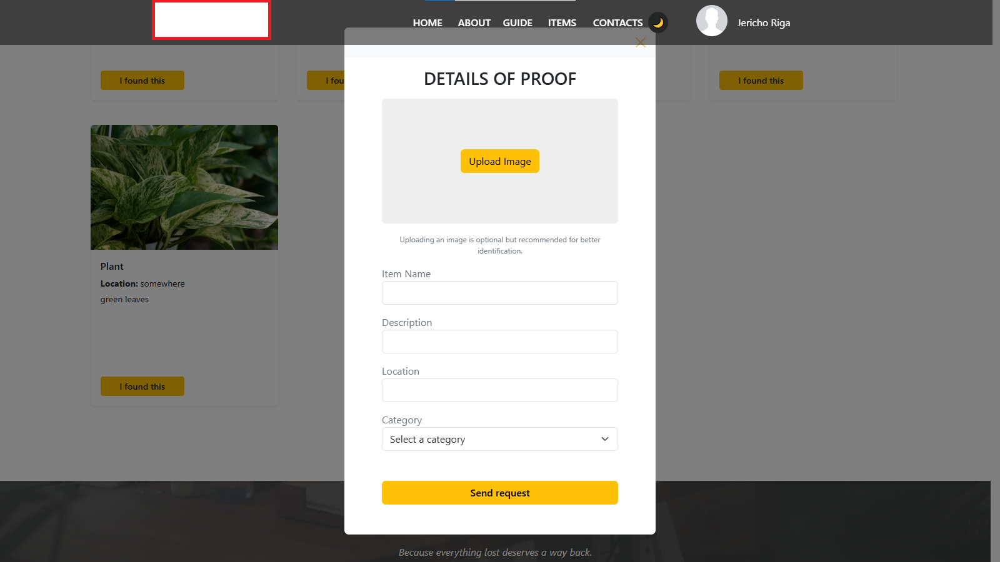
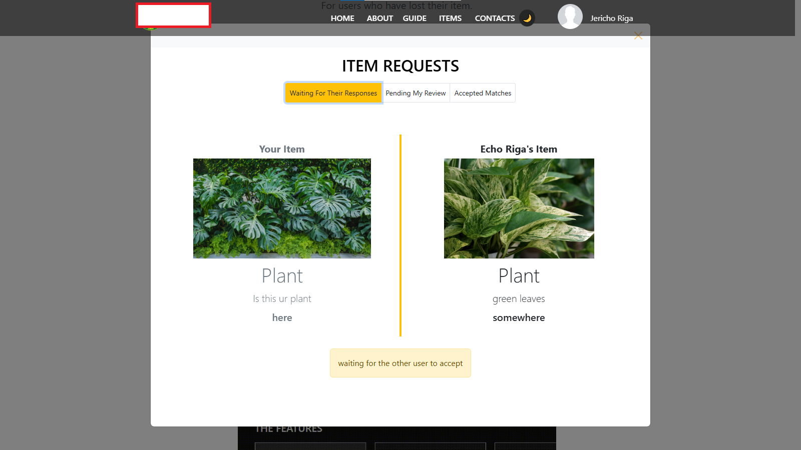
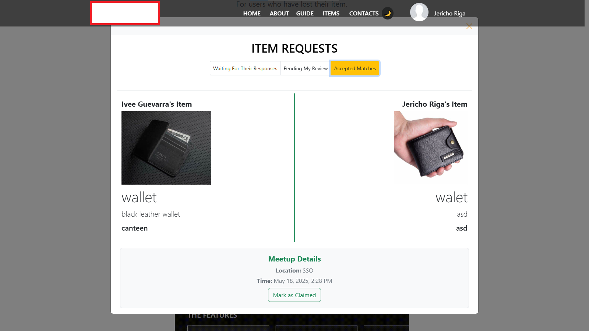
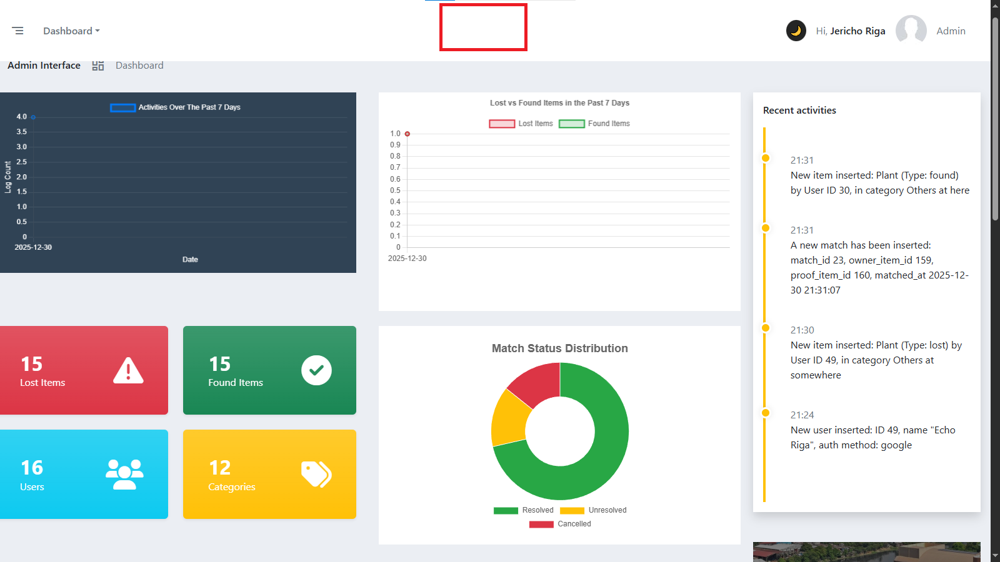
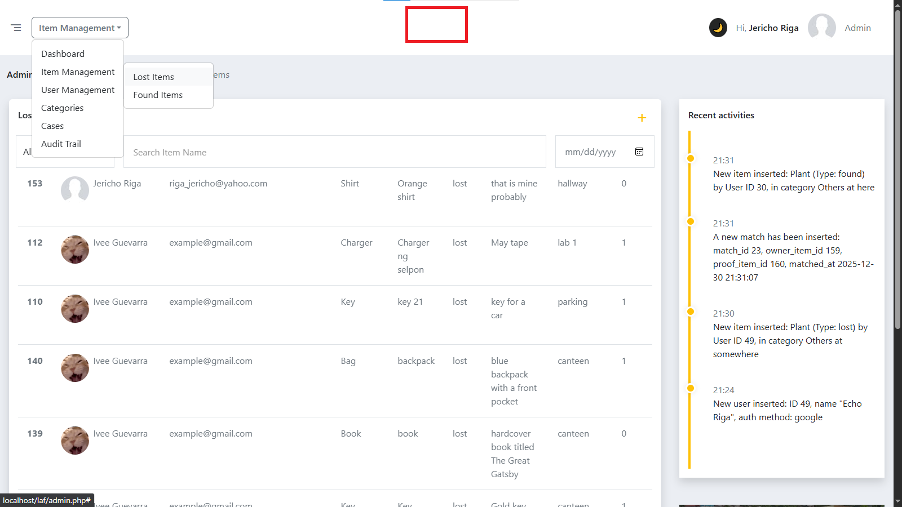
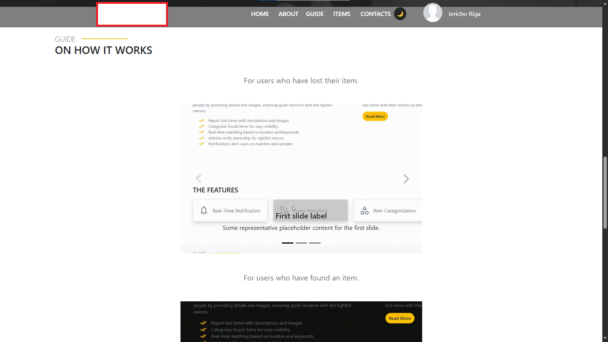

# Lost and Found System

##  Overview

Modern web platform where users can post, browse, and manage lost and found items with detailed attributes. Features a user-friendly interface with comprehensive item tracking and admin oversight.

---

##  Features

- Facebook and Google authentication
- Item request states: pending, accepted matches, waiting
- Modern and user friendly design
- Cloudinary integration for photo storage
- Detailed item attributes (location, photos, descriptions)
- Admin oversight and management

---

##  Screenshots

  
  
  
   
  
  
  
   
  
  
  

---

##  Tech Stack

| Component      | Technology |
| -------------- | ---------- |
| Backend        | PHP        |
| Frontend       | Bootstrap  |
| Authentication | Firebase   |
| Storage        | Cloudinary |
| Database       | MySQL      |

---

> **Note:** This repository intentionally excludes setup instructions and sensitive configuration details due to confidentiality requirements.

